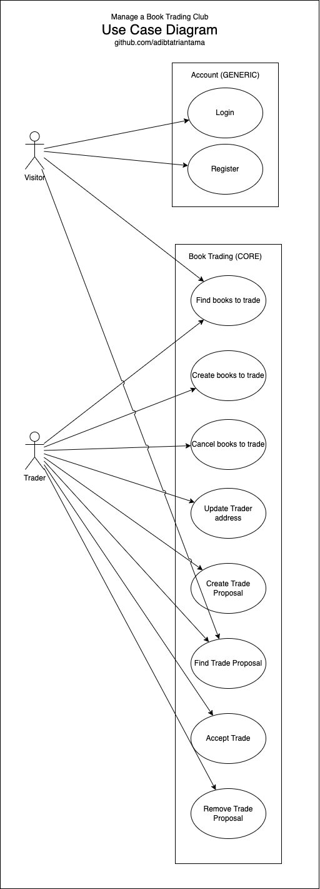

# Manage a Book Trading Club

## Description

Fullstack app for Free Code Camp Legacy Backend Certification

## User Stories

1. I can view all books posted by every user
2. I can add a new book
3. I can update my settings to store my full name, city, and state
4. I can propose a trade and wait for the other user to accept the trade

## Use Case Diagram

<p align="center">
  
</p>

## Entity Relationship Diagram

<p align="center">
  
</p>

## Installation

```bash
$ npm install

$ npx prisma generate
```

## Running the app

```bash
# development
$ npm run start

# watch mode
$ npm run start:dev

# production mode
$ npm run start:prod
```

## Test

```bash
# unit tests
$ npm run test

# e2e tests
$ npm run test:e2e

# test coverage
$ npm run test:cov
```

## License

[MIT licensed](LICENSE).
